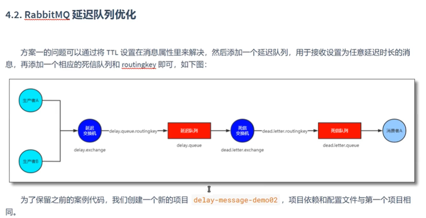
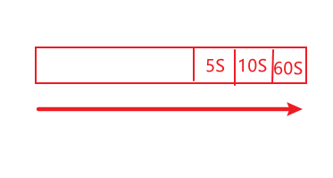

# 案例2

在前一个案例中可以看到，当需求增加时，就需要新增一个
队列来处理，在config中需要不断添加bean以完成需求，因此
在这个案例中，仅用一个延迟队列和一个死信队列来完成需求，
也就是先进先出的规则

这种方式会有一个明显的问题，那就是rabbit的队列是类似于栈的，
有先进先出的规则，如果先进入了一个60秒的消息，
再进入一个10秒的消息，那就是会导致10秒的被60秒的卡住，
只有当60秒的消息出队列，10秒的消息才能出队列
