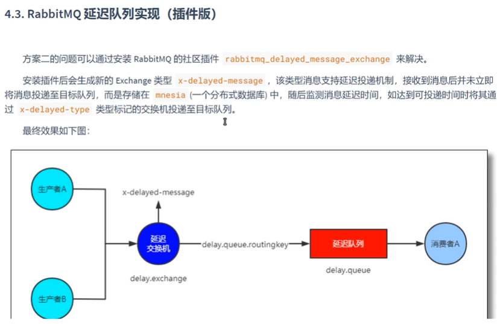

# 案例3

使用插件来实现订单延时功能



首先需要在服务器安装插件
从rabbit的官网中找到社区，并找到rabbitmq-delayed-message-exchange
官网为[https://github.com/rabbitmq/rabbitmq-delayed-message-exchange/releases]()
从中找到对应的版本并下载ez文件，接压后，传入到linux中的
```/usr/lib/rabbitmq/lib/rabbitmq_server-3.9.15/plugins/```中
使用下面的命令启动

```shell
systemctl restart rabbitmq-server
rabbitmq-plugins enable rabbitmq_delayed_message_exchange
```